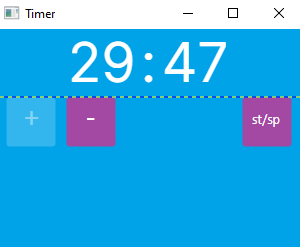
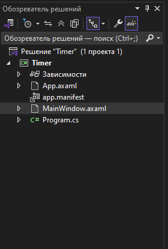
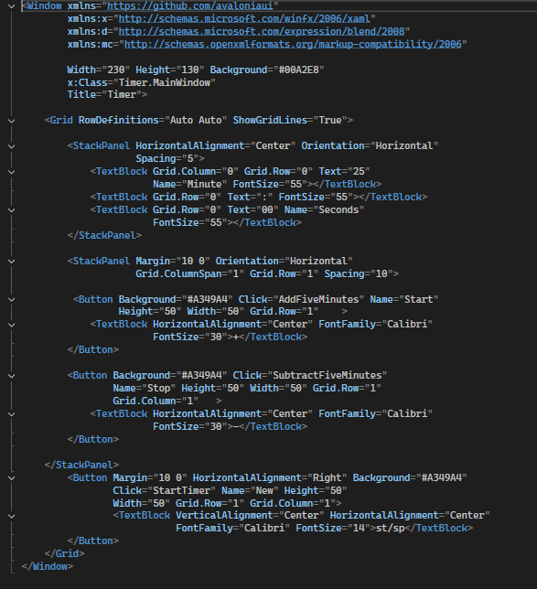

<h1 align="center"> Таймер на Авалонии</h1>




## Описание
Проект настольного приложения, митрующего работу таймера
## Начало работы
Эти инструкции предоставят вам копию проекта и помогут запустить на вашем локальном компьютере для разработки и тестирования.<br/>
### Необходимые условия
У вас должен быть установлен [Git Bush](https://gitforwindows.org/).
Также быть установлена с компонентами Avalonia  [Microsoft Visual Studio 2022](https://visualstudio.microsoft.com/ru/vs/community/)

### Установка
## Порядок
1. Клонирование репозитория<br/>```git init```<br/>```git clone https://github.com/1vanGromov/Readme2.git```<br/>
2. Запуск программы<br/>```Открыть файловый проект с расширением .sln```<br/>```Нажать на зеленую кнопку с названием проекта```<br/>
## Структура проекта



***
<br/>

Код основного экрана<br/>

***
<br/>

### Авторы
Гогс лежит, поэтому авторы будут без ссылок Громов И.Е. гр.41П Рзаев Е.Р. гр. 41П
